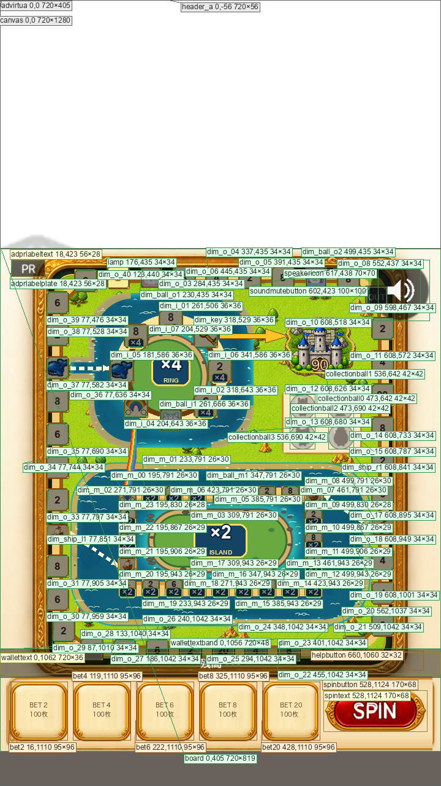

# warukyure / title — 実装済み画面の現状 (design-state/v1)

captured_commit: 7d38599   captured_at: 2026-09-04T06:02:18Z   base: 720x1280
image: state.png (sha256 631782c0091de963fb0a1b18362330dbc6fbb4a0e95792f2994c189bd119fed4)   state_sha256: d014d23c506bda379f0b196df88aace3f8143cf24f6ecf8e625a74d106c2e9b6

## 🛑 固定UI（間違えやすい枠）

| 種別 | id | x | y | w | h | visible | 規約値 | 判定 |
|---|---|---:|---:|---:|---:|---:|---|---|
| ヘッダーA | header_a | 0 | -56 | 720 | 56 | true | x=0 y=-56 w=720 h=56 | 一致 |
| ADVIRTUA | advirtua | 0 | 0 | 720 | 405 | true | x=0 y=0 w=720 h=405 | 一致 |
| ヘッダーB | なし | - | - | - | - | - | x=0 y=0 w=720 h=200 | なし |
| 広告フッター | なし | - | - | - | - | - | x=0 y=1180 w=720 h=100 | なし |

| id | role | x | y | w | h | z | text | desc |
|---|---:|---:|---:|---:|---:|---:|---|---|
| canvas | panel | 0 | 0 | 720 | 1280 | 0 |  | Canvas root |
| board | image | 0 | 405 | 720 | 819 | 1 |  | ボード（盤面） |
| collectionball0 | image | 473 | 642 | 42 | 42 | 2 |  |  |
| collectionball1 | image | 536 | 642 | 42 | 42 | 3 |  |  |
| collectionball2 | image | 473 | 690 | 42 | 42 | 4 |  |  |
| collectionball3 | image | 536 | 690 | 42 | 42 | 5 |  |  |
| dim_ball_o1 | image | 230 | 435 | 34 | 34 | 7 |  | 消灯マス |
| dim_o_03 | image | 284 | 435 | 34 | 34 | 8 |  | 消灯マス |
| dim_o_04 | image | 337 | 435 | 34 | 34 | 9 |  | 消灯マス |
| dim_o_05 | image | 391 | 435 | 34 | 34 | 10 |  | 消灯マス |
| dim_o_06 | image | 445 | 435 | 34 | 34 | 11 |  | 消灯マス |
| dim_ball_o2 | image | 499 | 435 | 34 | 34 | 12 |  | 消灯マス |
| dim_o_08 | image | 552 | 437 | 34 | 34 | 13 |  | 消灯マス |
| dim_o_09 | image | 598 | 467 | 34 | 34 | 14 |  | 消灯マス |
| dim_o_10 | image | 608 | 518 | 34 | 34 | 15 |  | 消灯マス |
| dim_o_11 | image | 608 | 572 | 34 | 34 | 16 |  | 消灯マス |
| dim_o_12 | image | 608 | 626 | 34 | 34 | 17 |  | 消灯マス |
| dim_o_13 | image | 608 | 680 | 34 | 34 | 18 |  | 消灯マス |
| dim_o_14 | image | 608 | 733 | 34 | 34 | 19 |  | 消灯マス |
| dim_o_15 | image | 608 | 787 | 34 | 34 | 20 |  | 消灯マス |
| dim_ship_r1 | image | 608 | 841 | 34 | 34 | 21 |  | 消灯マス |
| dim_o_17 | image | 608 | 895 | 34 | 34 | 22 |  | 消灯マス |
| dim_o_18 | image | 608 | 949 | 34 | 34 | 23 |  | 消灯マス |
| dim_o_19 | image | 608 | 1001 | 34 | 34 | 24 |  | 消灯マス |
| dim_o_20 | image | 562 | 1037 | 34 | 34 | 25 |  | 消灯マス |
| dim_o_21 | image | 509 | 1042 | 34 | 34 | 26 |  | 消灯マス |
| dim_o_22 | image | 455 | 1042 | 34 | 34 | 27 |  | 消灯マス |
| dim_o_23 | image | 401 | 1042 | 34 | 34 | 28 |  | 消灯マス |
| dim_o_24 | image | 348 | 1042 | 34 | 34 | 29 |  | 消灯マス |
| dim_o_25 | image | 294 | 1042 | 34 | 34 | 30 |  | 消灯マス |
| dim_o_26 | image | 240 | 1042 | 34 | 34 | 31 |  | 消灯マス |
| dim_o_27 | image | 186 | 1042 | 34 | 34 | 32 |  | 消灯マス |
| dim_o_28 | image | 133 | 1040 | 34 | 34 | 33 |  | 消灯マス |
| dim_o_29 | image | 87 | 1010 | 34 | 34 | 34 |  | 消灯マス |
| dim_o_30 | image | 77 | 959 | 34 | 34 | 35 |  | 消灯マス |
| dim_o_31 | image | 77 | 905 | 34 | 34 | 36 |  | 消灯マス |
| dim_ship_l1 | image | 77 | 851 | 34 | 34 | 37 |  | 消灯マス |
| dim_o_33 | image | 77 | 797 | 34 | 34 | 38 |  | 消灯マス |
| dim_o_34 | image | 77 | 744 | 34 | 34 | 39 |  | 消灯マス |
| dim_o_35 | image | 77 | 690 | 34 | 34 | 40 |  | 消灯マス |
| dim_o_36 | image | 77 | 636 | 34 | 34 | 41 |  | 消灯マス |
| dim_o_37 | image | 77 | 582 | 34 | 34 | 42 |  | 消灯マス |
| dim_o_38 | image | 77 | 528 | 34 | 34 | 43 |  | 消灯マス |
| dim_o_39 | image | 77 | 476 | 34 | 34 | 44 |  | 消灯マス |
| dim_o_40 | image | 123 | 440 | 34 | 34 | 45 |  | 消灯マス |
| dim_i_01 | image | 261 | 506 | 36 | 36 | 46 |  | 消灯マス |
| dim_i_07 | image | 204 | 529 | 36 | 36 | 47 |  | 消灯マス |
| dim_i_05 | image | 181 | 586 | 36 | 36 | 48 |  | 消灯マス |
| dim_i_04 | image | 204 | 643 | 36 | 36 | 49 |  | 消灯マス |
| dim_ball_i1 | image | 261 | 666 | 36 | 36 | 50 |  | 消灯マス |
| dim_i_02 | image | 318 | 643 | 36 | 36 | 51 |  | 消灯マス |
| dim_i_06 | image | 341 | 586 | 36 | 36 | 52 |  | 消灯マス |
| dim_key | image | 318 | 529 | 36 | 36 | 53 |  | 消灯マス |
| dim_m_00 | image | 195 | 791 | 26 | 30 | 54 |  | 消灯マス |
| dim_m_01 | image | 233 | 791 | 26 | 30 | 55 |  | 消灯マス |
| dim_m_02 | image | 271 | 791 | 26 | 30 | 56 |  | 消灯マス |
| dim_m_03 | image | 309 | 791 | 26 | 30 | 57 |  | 消灯マス |
| dim_ball_m1 | image | 347 | 791 | 26 | 30 | 58 |  | 消灯マス |
| dim_m_05 | image | 385 | 791 | 26 | 30 | 59 |  | 消灯マス |
| dim_m_06 | image | 423 | 791 | 26 | 30 | 60 |  | 消灯マス |
| dim_m_07 | image | 461 | 791 | 26 | 30 | 61 |  | 消灯マス |
| dim_m_08 | image | 499 | 791 | 26 | 30 | 62 |  | 消灯マス |
| dim_m_09 | image | 499 | 830 | 26 | 28 | 63 |  | 消灯マス |
| dim_m_10 | image | 499 | 867 | 26 | 29 | 64 |  | 消灯マス |
| dim_m_11 | image | 499 | 906 | 26 | 29 | 65 |  | 消灯マス |
| dim_m_12 | image | 499 | 943 | 26 | 29 | 66 |  | 消灯マス |
| dim_m_13 | image | 461 | 943 | 26 | 29 | 67 |  | 消灯マス |
| dim_m_14 | image | 423 | 943 | 26 | 29 | 68 |  | 消灯マス |
| dim_m_15 | image | 385 | 943 | 26 | 29 | 69 |  | 消灯マス |
| dim_m_16 | image | 347 | 943 | 26 | 29 | 70 |  | 消灯マス |
| dim_m_17 | image | 309 | 943 | 26 | 29 | 71 |  | 消灯マス |
| dim_m_18 | image | 271 | 943 | 26 | 29 | 72 |  | 消灯マス |
| dim_m_19 | image | 233 | 943 | 26 | 29 | 73 |  | 消灯マス |
| dim_m_20 | image | 195 | 943 | 26 | 29 | 74 |  | 消灯マス |
| dim_m_21 | image | 195 | 906 | 26 | 29 | 75 |  | 消灯マス |
| dim_m_22 | image | 195 | 867 | 26 | 29 | 76 |  | 消灯マス |
| dim_m_23 | image | 195 | 830 | 26 | 28 | 77 |  | 消灯マス |
| lamp | image | 176 | 435 | 34 | 34 | 78 |  |  |
| advirtua | panel | 0 | 0 | 720 | 405 | 79 |  | Ad-Virtua領域 |
| adprlabelplate | image | 18 | 423 | 56 | 28 | 80 |  |  |
| adprlabeltext | text | 18 | 423 | 56 | 28 | 81 | PR |  |
| wallettextband | image | 0 | 1056 | 720 | 48 | 82 |  | 残高帯 |
| wallettext | text | 0 | 1062 | 720 | 36 | 83 | 残高 --- | 残高テキスト |
| helpbutton | button | 660 | 1060 | 32 | 32 | 84 |  | ヘルプボタン |
| bet2 | button | 16 | 1110 | 95 | 96 | 85 |  |  |
| bet4 | button | 119 | 1110 | 95 | 96 | 87 |  |  |
| bet6 | button | 222 | 1110 | 95 | 96 | 89 |  |  |
| bet8 | button | 325 | 1110 | 95 | 96 | 91 |  |  |
| bet20 | button | 428 | 1110 | 95 | 96 | 93 |  |  |
| spinbutton | button | 528 | 1124 | 170 | 68 | 95 |  | SPINボタン |
| spintext | text | 528 | 1124 | 170 | 68 | 96 | SPIN |  |
| soundmutebutton | image | 602 | 423 | 100 | 100 | 112 |  | サウンドミュートボタン |
| speakericon | image | 617 | 438 | 70 | 70 | 113 |  |  |
| header_a | panel | 0 | -56 | 720 | 56 | 1000 |  | ヘッダーA（HTMLオーバーレイ／Unityキャンバスの外・上側／キャンバス座標では y=-56 から始まる／`.common-header-bar`・規約 game-layout-standard.md §1） |
